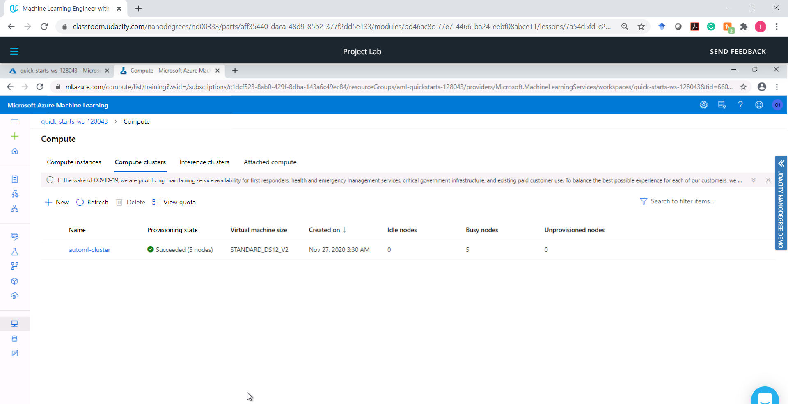

# Deploying a Machine Learning Pipeline in Microsoft Azure

This project covers the end to end process of operationalising a maching learning model. From creating a machine learning model using Azure AutoML, deploying the model, and consuming it as a webservice. It also demonstrates the use of `Jupyter Notebook` in Azure SDK for creating AutoML pipelines as well as for deploying and consuming ML models. 

A bank marketing dataset was used in the Azure AutoML Machine Learning Service to develop a classification model that determines if a client would subscribe to a marketing campaign or not. Azure machine learning studio was used to configure an AutoML experiment that explores a variety of classification models using some AutoML configuration parameters. At the end of the experiment, the best performing model (a VotingEnsemble model with an accuracy of 0.92) was deployed to provide a `REST endpoint` for interacting with the model. 
Post model deployment, Application Insights was enabled using Azure SDK to enable collection of logging information from the deployed model. The Swagger JSON file provided by Azure for the deployed model was downloaded from the `Endpoints` section in Azure under the `Swagger URL` and saved in a `swagger.json` file. The contents of the API for the model was displayed and the deployed model was consumed using `Swagger`. The deployed model was also benchmarked to obtain a baseline performance that can be used for evaluating the model behaviour in the future. 

Using the same bank marketing dataset, a `Jupyter Notebook` was used to create an AutoML machine learning pipeline using Azure Python SDK. The AutoML pipeline was deployed producing a pipeline endpoint that was used to consume the model. The completed pipeline run in Azure SDK produced the same model results as obtained using the Azure Machine Learning Studio.

## Architectural Diagram
An architectural diagram that visualises the project workflow is shown below. It highlights the various stages that were critical to the completion of the project. 

 

## Key Steps
The architectural diagram captures 7 major steps that are briefly described in this section.

### Step 1: Authentication

During the authentication step, the Azure Machine Learning Extension that enables interaction with the Azure Machine Learning Studio, part of the **az** command is installed and enabled in the terminal. Afterwards, a Service Principal account is created and associated with the specific workspace. This step is required when using a personal Azure account. However, for this course, the lab envirionment provided by Udacity was used and it did not provide authorisation to create a service principal so this step was skipped. This did not affect the fulfilment of the other steps required in the project.

### Step 2: Automated ML experiment

In this step, an Automated ML experiment was created and a compute cluster configured to run the experiment. The banking dataset available [here](https://automlsamplenotebookdata.blob.core.windows.net/automl-sample-notebook-data/bankmarketing_train.csv) was registered in Azure ML studio and used for the AutoML model configuration and training. The experiment was set up by performing a sequence of activities as follows:

#### a. Upload and Register the Banking Dataset

The bank marketing data was uploaded and registered in Azure as a dataset

#### b. Create a compute cluster

A compute cluster was created to be used for running the model training experiment.

#### c. Completed AutoML Experiment

The configured AutoML experiment is completed showing the best model summary. 

#### d. Best model after the experiment completes

The best model obtained is the VotingEnsemble model. An overview of the model shows an accuracy metric of 0.92.

### Step 3: Deploy the Best Model

Here, the best model is deployed to enable interaction with the model by sending data over POST requests via the HTTP API service.

#### a. Deploy Best Model 

The Best Model was selected and deployed using Azure Container Instance (ACI) with enabled authentication. 

#### b. Best Model Deployment Succeeded

The Best Model was successfully deployed. The deploy status shows **Succeeded**.

### Step 4: Enable Application Insights

Post deployment, Application Insights was enabled to retrieve log information from the deployed model. This step was completed by editing and running the *logs.py* script that enabled Application Insights using Azure Python SDK.

#### a. Application Insights is enabled 
The *log.py* script was modified to include a line that enables application insights:

`service.update(enable_app_insights=True)`.

The script set the application insights variable and enabled logging. The screenshot shows that Application Insights is now set to True and that the Best Model was successfully deployed as a REST endpoint accessible via the Endpoint section.

#### b. Sample logs provided after running logs.py

Here is a sample of log information produced by the deployed model.

### Step 5: Swagger Documentation

In this step, the deployed model was consumed using Swagger. The Swagger JSON file provided by Azure for the deployed model was downloaded from the Endpoints section in Azure under the Swagger URL and saved in a file named *swagger.json*. The *swagger.sh* script was modified and used to download the lastest Swagger container and to run it in on Port 9000. 
The *serve.py* script  starts a local server that makes it possible to access the *swagger.json* file over the HTTP protocol, expected by the Swagger User Interface (UI).  The script was used to start a Python server on port 8000. 
The *serve.py* script was placed right next to the downloaded *swagger.json* file and the contents of the API for the model was displayed using Swagger.

#### Swagger runs on local host 

Swagger is used to visualize the API definition contained in *swagger.json*. It shows the HTTP API methods and responses for the deployed model.

### Step 6: Consume Model Endpoints

The *endpoint.py* script was used to interact with the deployed model via the REST endpoint. The **scoring_url** and the **key information** was modified to match the key for the model service and the URL that was generated after deployment. The URL is found in the Details tab, above the Swagger URI.

#### a. Output of Consuming Model Endpoint

Running the *endpoint.py* script produced a JSON format output from the model in addition to a *data.json* file output.

#### b. Benchmark the Model Endpoint

The model endpoint was benchmarked using the Apache bench in order to load-test the model. The Apache benchmark command-line tool was installed. The *benchmark.sh* file containing the following code was run to produce a benchmark information for the deployed model:

`ab -n 10 -v 4 -p data.json -T 'application/json' -H 'Authorization: Bearer REPLACE_WITH_KEY' http://REPLACE_WITH_API_URL/score`

The following screenshots show the Apache Benchmark(**ab**) running against the HTTP API using authentication keys to retrieve performance results.

### Step 7: Create, Publish and Consume a Pipeline

In this step, a Jupyter Notebook provided as a starter file was used to create, publish and consume a pipeline using Azure Python SDK. The notebook was uploaded to the Azure ML studio and all the variables were updated to use the same **keys**, **URL**, **dataset**, **cluster**, and **model names** as created in the preceeding steps using AutoML.
The *config.json* file was downloaded and saved in the current working directory. The cells of the notebok were run through to create a pipeline that is visible in the Pipelines section of Azure ML studio. The pipeline was verified to be *Active* and *Running* in the Azure ML studio.

#### a. Pipeline section of the Azure ML studio showing created pipeline

#### b. Pipeline section of the Azure ML studio showing pipeline Endpoint

#### c. The Bankmarketing dataset used with the AutoML module

#### d. The "Published Pipeline overview" showing a REST endpoint and a status of ACTIVE

#### e. Jupyter Notebook showing run steps using the "Use RunDetails Widget"

#### f. Azure ML studio showing the scheduled and completed pipeline runs

## Suggested Improvement
The model performance may be improved by performing feature engineering on the bank marketing dataset. Also, the experiment time out period can be increased from 20 minutes to say 30-45 minutes to allow more models to be explored in order to optimise performance.

## Screen Recording

A screen recording of the project in action is available [here](https://youtu.be/JQ1W6YewmyY)

